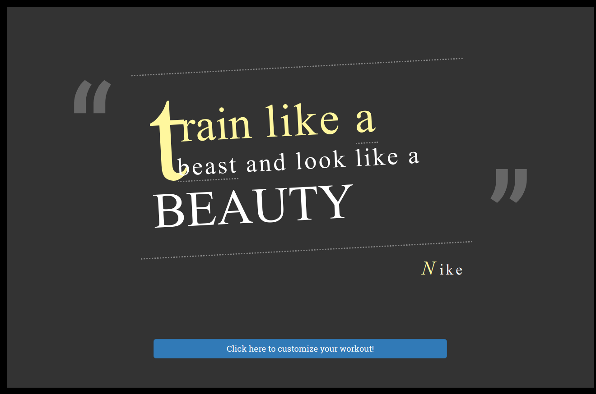

# HIIT it hard timer

## Architecture and Technologies
This application was built with pure Javascript.

## Background
HIIT it hard timer is a customizable HIIT workout timer where users can pick:
* the length work interval
* the length of rest interval
* number of rounds
* type of exercises
* total number sets 
* A good example is the classic HIIT 50 seconds of work and 10 seconds of rest or
a TABATA session of 20 seconds work and 10 seconds rest.
* During the 50 seconds of work, a giphy will be displayed to show users what 
exercise they need to do for that interval.
#Train Like a Beast, Look Like a Beauty

[HIIT-it-hard timer](https://chinweenie.github.io/HIIT-it-hard-timer/)


## Technical details
```javascript
handleDragStart(e){
        const target = this.checkTarget(e.target);
        this.dragSrcEl = target;
        e.dataTransfer.effectAllowed = 'move';
        e.dataTransfer.setData('text/html', target.outerHTML);

        target.classList.add('dragElem');
    }

    handleDragOver(e){
        if(e.preventDefault) {
            e.preventDefault(); // Necessary. Allows us to drop.
        }
        const target = this.checkTarget(e.target);
        target.classList.add("over");
        e.dataTransfer.dropEffect = 'move';  // See the section on the DataTransfer object.

        return false;
    }

    handleDragEnter(e) {
    // this / e.target is the current hover target.
    }

    handleDragLeave(e){
        const target = this.checkTarget(e.target);
        target.classList.remove("over");
    }

    handleDrop(e){
        if (e.stopPropagation) {
            e.stopPropagation(); // Stops some browsers from redirecting.
        }
        const target = this.checkTarget(e.target);
        // Don't do anything if dropping the same column we're dragging.
        if (this.dragSrcEl != target) {
            // Set the source column's HTML to the HTML of the column we dropped on.
            //alert(this.outerHTML);
            //dragSrcEl.innerHTML = this.innerHTML;
            //this.innerHTML = e.dataTransfer.getData('text/html');
            target.parentNode.removeChild(this.dragSrcEl);
            const dropHTML = e.dataTransfer.getData('text/html');
            target.insertAdjacentHTML('beforebegin', dropHTML);
            const dropElem = target.previousSibling;
            this.addDnDHandlers(dropElem);
        }
        target.classList.remove('over');
        return false;
    }

    handleDragEnd(e){
        const target = this.checkTarget(e.target);
        target.classList.remove('over');
        target.classList.remove('dragElem');
    }

addDnDHandlers(elem) {
        elem.addEventListener('dragstart', (e) => this.handleDragStart(e), false);
        elem.addEventListener('dragenter', (e) => this.handleDragEnter(e), false)
        elem.addEventListener('dragover', (e) => this.handleDragOver(e), false);
        elem.addEventListener('dragleave', (e) => this.handleDragLeave(e), false);
        elem.addEventListener('drop', (e) => this.handleDrop(e), false);
        elem.addEventListener('dragend', (e) => this.handleDragEnd(e), false);
    }
```
